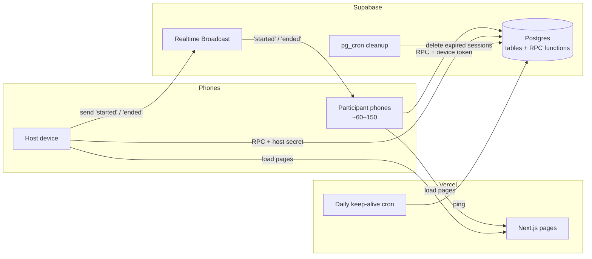
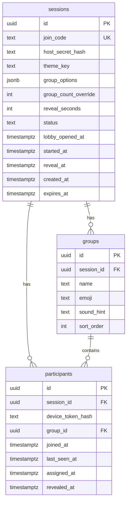
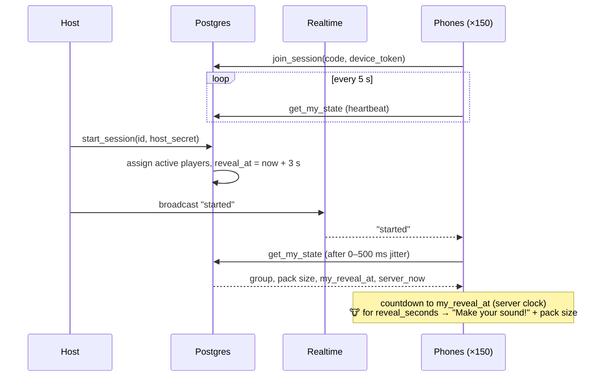

# ARCHITECTURE: Find Your Pack (working name)

**Status:** Draft v0.7
**Related:** `PRD.md`, `ARCHITECTURE-ESSENTIALS.md`

---

## 1. Summary
A Next.js app on Vercel handles the UI. Supabase Postgres holds all state and all trusted logic, in Postgres functions called over RPC. A Supabase Realtime broadcast tells phones when the game starts.

**Key rules:**
- **No personal data and no auth service.** Players are identified by a random **device token** made in the browser. Hosts by a **host secret** in their private link. No names, emails, or logins.
- **Group assignments don't exist until the host presses Start.** There is nothing to leak before then.
- **Everyone reveals at the same moment.** At Start, the server sets a `reveal_at` time 3 seconds ahead. Each phone counts down to it using the server's clock, so it doesn't matter when exactly each phone heard about Start.
- **The server stops returning a player's group after their reveal window.** Refreshing or inspecting the page can't bring it back.
- **Finding your pack is confirmed in real life**, not in the app.
- Sessions expire 1–7 days after creation (host-chosen) and are then deleted.

### What changed in v0.6 (review fixes)
| Change | Why |
|---|---|
| Dropped Supabase Anonymous Sign-In; using a browser-made device token instead | Anonymous sign-ins are rate-limited **per IP (30/hour by default)**. 100+ phones on one venue Wi-Fi share an IP, so most would fail to join. |
| Dropped `claim_host` and `host_user_id`; host functions take the host secret directly | Simpler. Whoever has the host link is the host. |
| Dropped Postgres Changes and the `pack_resized` broadcast; host and pack size use light polling | Postgres Changes needs auth + RLS policies. Polling one host device and pack sizes every 10 s is cheap and simpler. |
| Added a server-scheduled `reveal_at` | Makes the reveal simultaneous even if phones fetch at different times. Jitter no longer affects fairness. |
| Reveal window now starts from when the phone **first receives** its group (`revealed_at`) | A phone that was locked at Start would otherwise wake up after the window and never see its animal. |
| Added `last_seen_at` heartbeat; Start assigns only recently active phones | Stops "ghost" players (left, or scanned in a different browser) from inflating pack sizes. Sleeping phones are assigned when they wake. |
| Added a daily keep-alive | Supabase free projects can be paused after a period of inactivity; a monthly event would hit a paused database. |

## 2. Tech stack
| Layer | Choice | Why |
|---|---|---|
| Frontend | **Next.js (App Router) + TypeScript** | Deploys to Vercel with no config. |
| Styling | **Tailwind CSS** | Fast mobile-first UI. |
| Hosting | **Vercel** | Free tier; also runs the daily keep-alive cron. |
| Database + logic | **Supabase Postgres** with RPC functions | Transactions and row locks for safe assignment. All trusted logic lives here. |
| Real-time | **Supabase Realtime Broadcast** (one public channel per session) | Instantly tells phones "Start was pressed". No auth needed. |
| Identity | **Device token** (`crypto.randomUUID()` in `localStorage`) | No auth service, so no sign-in rate limits and no personal data. |
| Scheduled jobs | **pg_cron** (cleanup) + **Vercel Cron** (keep-alive) | |
| QR codes | **qrcode.react** | Generated in the browser. |
| Validation | **Zod** | Custom group names, timer, expiry. |
| Testing | **Vitest** (logic), **k6** (load) | |

**Alternative considered:** a custom Node.js + Socket.IO server. More to learn about WebSockets, but a second deployment to run. Supabase is the faster path to v1.

> ⚠️ Before the event, check Supabase's current free-tier limits (concurrent Realtime connections and inactivity pausing) against ~150 phones.

## 3. System overview

Phones call Supabase directly with the public anon key. Tables are locked down completely; the only way in is through the RPC functions, which check tokens themselves.

## 4. Data model

### 4.1 Entity relationships


### 4.2 Tables
**`sessions`** — one row per icebreaker run. Lives until its host-chosen expiry (1–7 days).
| Column | Type | Notes |
|---|---|---|
| `id` | uuid PK | |
| `join_code` | text, unique | 6 characters, no lookalikes (no `0/O`, `1/I`). In the QR URL. |
| `host_secret_hash` | text | SHA-256 of the secret in the private host link. Raw secret never stored. |
| `theme_key` | text, nullable | Label only, e.g. `animals`. Null when custom names are used. |
| `group_options` | jsonb, not null | The list groups are drawn from, always stored on the session, e.g. `[{"name":"Cow","emoji":"🐮","sound_hint":"Moo!"}]`. For a preset, the client copies the list from `lib/themes.ts`, because Postgres functions can't read that file. 2–20 entries, names 1–30 characters. |
| `group_count_override` | int, nullable | Host override; otherwise computed at Start. |
| `reveal_seconds` | int, default 5 | Range 2–30. Set before Start. |
| `status` | enum `scheduled` / `lobby` / `started` | `scheduled` = created, not open for joining. Ending deletes the row. There is deliberately no "between rounds" value: a game stays `started` and `round` moves instead, so no phone ever sees a state that looks like the end. |
| `lobby_opened_at`, `started_at` | timestamptz | |
| `reveal_at` | timestamptz | `started_at + 3 s`. The moment every phone reveals. Re-stamped at the start of each round. |
| `round` | int, default 0 | 0 before Start, then 1 and up — one per round the host has run (§5.1a). |
| `created_at`, `expires_at` | timestamptz | `expires_at` = created + 1–7 days (default 7). |

**`groups`** — created at **Start**, not before, and then **reused for every round**: a new round changes who is in each pack, never how many packs there are or what they are called.
| Column | Type | Notes |
|---|---|---|
| `id` | uuid PK | |
| `session_id` | uuid FK → sessions, cascade delete | |
| `name` | text | e.g. `Cow` or a custom name. |
| `emoji`, `sound_hint` | text, nullable | Empty for custom groups. |
| `sort_order` | int | |

**`participants`** — one row per browser per session. **No personal data.**
| Column | Type | Notes |
|---|---|---|
| `id` | uuid PK | |
| `session_id` | uuid FK → sessions, cascade delete | |
| `device_token_hash` | text | SHA-256 of the browser's device token. Unique per session, so a refresh rejoins the same row. |
| `group_id` | uuid FK → groups, nullable | **NULL until assigned**, and nulled again at the start of each round. |
| `joined_at` | timestamptz | |
| `last_seen_at` | timestamptz | Updated on every `get_my_state` call (heartbeat). |
| `assigned_at` | timestamptz, nullable | When the group was assigned. |
| `revealed_at` | timestamptz, nullable | First time `get_my_state` returned the group. Set once per round, and cleared when a new round starts — without that clear the window would already be closed and nobody would see a second reveal. Anchors the reveal window. |
| `prev_group_id` | uuid FK → groups, nullable, **set null** on delete | The pack this phone had in the round before, so "never the same animal twice in a row" is checked in one place (§5.1a). Not cascade: `group_id`'s cascade is what makes deleting a group delete the player, and this column must not inherit that. |

**Indexes:** unique `participants(session_id, device_token_hash)`, `participants(group_id)`, unique `sessions(join_code)`, `sessions(expires_at)`.

**Access:** RLS is enabled on every table with **no policies**, so the anon key can't read or write tables directly. Everything goes through the functions below.

### 4.3 Themes (in code for v1)
`lib/themes.ts` holds the animal preset: cow, dog, cat, duck, sheep, chicken, pig, monkey, frog, snake, plus spares owl and lion. Each has a name, emoji, and sound hint. The chosen preset or custom names are copied into `sessions.group_options` at creation.

## 5. Core logic (Postgres functions)
All functions are `SECURITY DEFINER` with a fixed `search_path`, run as one transaction, hash any token they receive before comparing, and reject expired sessions.

| Function | Auth | What it does |
|---|---|---|
| `create_session(groups, reveal_seconds, expires_in_days)` | none | Creates a `scheduled` session. Returns `session_id`, `join_code`, and the raw host secret (shown once, inside the host link). |
| `get_host_state(session_id, host_secret)` | host secret | Status, settings, **active player count**, and group sizes after Start. Host polls every 3 s. |
| `update_settings(session_id, host_secret, …)` | host secret | Before Start only. Expiry counted from `created_at`, max 7 days. |
| `open_lobby(session_id, host_secret)` | host secret | `scheduled` → `lobby`. |
| `start_session(session_id, host_secret)` | host secret | Requires `lobby` and ≥2 active players. Creates the groups, assigns (5.1), sets `reveal_at` and `round = 1`. Still idempotent: a second tap never reshuffles a running game — that is `start_next_round`. |
| `start_next_round(session_id, host_secret)` | host secret | Requires `started`, the current reveal window to be over, and ≥2 active players. Clears the room, deals again avoiding each player's previous pack (5.1a), bumps `round`, re-stamps `reveal_at`. |
| `end_session(session_id, host_secret)` | host secret | Deletes the session (cascade). The host page broadcasts `ended` first. |
| `join_session(join_code, device_token)` | device token | `not_open` if `scheduled`; `ended` if missing or expired. Otherwise inserts or returns the participant row. |
| `get_my_state(session_id, device_token)` | device token | Heartbeat + state. Assigns the caller if needed (5.2) and enforces the reveal window (5.3). |

### 5.1 Start: balanced assignment
```
start_session:
  lock session row (SELECT … FOR UPDATE)
  require valid host secret, status = 'lobby'
  active = participants where last_seen_at > now() - 60 s
  require count(active) >= 2
  list = session.group_options
  G = group_count_override ?? clamp(floor(N_active / 3), 1, min(10, len(list)))
  G = min(G, len(list))
  insert first G entries of list as groups
  shuffle active participants; assign i → group (i mod G), assigned_at = now()   -- sizes differ by ≤1
  status = 'started', started_at = now(), reveal_at = now() + 3 s
```
Inactive rows are **not** assigned at Start. If they're real people whose phones were asleep, they get assigned the moment their phone checks in again (5.2). True ghosts never check in, so they never inflate a pack.

### 5.1a Rounds: dealing the room again
One round is often not enough time, so the host can deal the room as many times as they like and ends the game when they choose (PRD H10). `groups` is created once and reused; only who is in each pack changes.

```
start_next_round:
  lock session row
  require status = 'started'
  require now() >= reveal_at + reveal_seconds + 3 s     -- the reveal must be over
  require >= 2 active players
  participants: prev_group_id = group_id, then group_id / assigned_at / revealed_at = NULL
  _deal_round(G = count(groups), avoid_previous = true)
  round += 1, started_at = now(), reveal_at = now() + 3 s
```

Three of those lines are load-bearing:
- **The window check doubles as the double-tap guard.** A second call lands inside the window it just set and is refused, so no extra idempotency flag is needed.
- **`revealed_at` must be cleared.** It is otherwise written once and never reset, and it anchors `window_end` — leave it and every phone computes a window that closed minutes ago and drops straight to `hidden` with no reveal at all.
- **Every participant is cleared, not just the active ones.** Otherwise someone who went home after round 1 still counts towards a round-2 pack size.

**Never the same animal twice (PRD A6).** A plain reshuffle leaves roughly `N/G` players where they were. Rotating whole packs (`new = old + 1`) would guarantee a change but move each pack intact, so the same people find each other again — which is the game. So `_deal_round` deals at random and then *repairs*, and since a repair swaps two players' `group_id`s it can never change a pack's size:

```
deal as in 5.1
G = 2 : forced — everyone crosses to the other side; a phone with no previous
        pack fills the smaller one
G >= 3: pass A — pair two collisions in different packs; each takes the other's,
                 both fixed in one swap
        pass B — whatever is left is all in one pack, so each swaps with a
                 non-colliding player elsewhere whose own previous pack is not
                 the one we are leaving
```
A collision is a player whose new pack equals their old one. Pass B's partner always exists once there are three packs: it could only be missing if every player outside pack X had come from X, and with balanced sizes that needs `N(G-1)/G` players to have come from a pack of about `N/G` — impossible unless `G ≤ 2`, which is exactly why two packs is handled on its own. Anything still colliding is accepted rather than raised: failing a round start in front of 120 people is worse than one player repeating an animal.

`lib/assignment.ts` mirrors this as `reassignAvoidingPrevious` so it can be unit-tested; the SQL is what runs.

### 5.2 Late or waking players
```
get_my_state, if status = 'started' and caller has no group:
  lock session row                     -- prevents two arrivals racing for one spot
  assign to the group with fewest members (ties → lowest sort_order)
  assigned_at = now()
```
Covers both late joiners and phones that were asleep when the round was dealt. Their own reveal time is `assigned_at + 3 s`.

Among the groups tied for smallest, one that is **not** this phone's `prev_group_id` is preferred. Deliberately only a tie-break: letting A6 outrank size would let a handful of waking phones all skip the smallest pack and push sizes past ±1, which the host can see on the projector. So A6 is absolute for a round's deal and best-effort for a phone that wakes mid-round.

### 5.3 Reveal timing and window
```
my_reveal_at = greatest(session.reveal_at, assigned_at + 3 s)
if group is about to be returned and revealed_at is null: revealed_at = now()
window_end   = greatest(my_reveal_at, revealed_at) + reveal_seconds + 3 s grace

get_my_state returns:
  status = 'scheduled'      → { status: "not_open" }
  status = 'lobby'          → { status: "waiting", server_now }
  now() <  window_end       → { status: "reveal", group, pack_size, my_reveal_at, reveal_seconds, round, server_now }
  now() >= window_end       → { status: "hidden", pack_size, round }
  session missing/expired   → { status: "ended" }
```
- **Same-moment reveal:** the phone computes `clock_offset = server_now − local_now` and runs the 3-2-1 countdown to `my_reveal_at` on the server's clock. A phone that hears about Start 1 second late just shows a shorter countdown.
- **Locked phones still get their reveal:** the window starts from `revealed_at`, the first time the phone actually received its group, not from Start — so a phone unlocked late still gets a full reveal of whichever round it woke up in (PRD P7).
- **No re-peek:** after `window_end`, the group is never returned again, even after a refresh. This reads **per round**: a new round opens a *new* window rather than reopening the old one, because `start_next_round` cleared `revealed_at` and re-stamped `reveal_at`. The pack from a finished round is gone for good.
- **Pack size** is always `count(participants where group_id = X)`.
- Known gap: the group arrives up to 3 seconds before `my_reveal_at` (during the countdown), so someone inspecting network traffic could see it slightly early. Acceptable for an icebreaker.

### 5.4 Pack completion and "last"
Handled **in real life**. Packs announce when they reach their pack size; the host judges who was last.

## 6. Real-time and polling

### 6.1 What updates how
| What | How | Frequency |
|---|---|---|
| Start / new round / End signal to phones | Realtime Broadcast on `session:{join_code}` (`started`, `ended`), sent by the host page. A new round **reuses `started`** — events carry no data, so a phone re-asks the server either way and a fourth event name would buy nothing | Instant |
| Fallback for a missed broadcast | Phone polls `get_my_state` while waiting | Every 5 s |
| Recovering a lost spot (`not_joined`) | Phone re-joins once, then polls `get_my_state` | Every 5 s, `NOT_JOINED_RECHECKS` times, then stop |
| Pack size after reveal | Phone polls `get_my_state` | Every 10 s, and when the tab becomes visible again |
| Host lobby count and group sizes | Host polls `get_host_state` | Every 3 s |

- Broadcast events carry **no data**. On any event, a phone just calls `get_my_state` (or `join_session`, on the join screen). A prankster sending a fake `started` — or a fake `ended` — therefore changes nothing: no screen changes until the server says so.
- On `started`, each phone waits a random 0–500 ms before fetching. This spreads the burst, and `reveal_at` keeps the reveal simultaneous anyway.
- On `visibilitychange` (phone unlocked or tab reopened), the phone calls `get_my_state` immediately.
- A **new round** needs no new client state. `usePlayerScreen` keys its reveal anchor on `my_reveal_at`, which `start_next_round` re-stamps, so a phone sitting on `hidden` counts down and reveals again on its own. The `hidden → countdown` change runs the block wipe (`useSwapWipe`, DESIGN.md §7), because cutting straight from "Make your sound!" to a bare "3" reads as a glitch rather than as the next round starting. `hidden → revealed` stays an instant cut: a phone that woke up mid-reveal has little window left and must not spend it under the columns.
- `not_joined` is **recovered from, not displayed**. `get_my_state` returns it when there is no participant row for this device — a browser that lost its device token, or a phone that reached `/play` without going through `/join`. The phone re-joins once (`join_session` is the only thing that can recreate the row, and it still refuses while the lobby is shut) and keeps polling every 5 s for `NOT_JOINED_RECHECKS` answers, holding whatever screen it already had. Only when those are spent does it show the `lost_spot` screen, which asks the player to scan the QR code again. Bounded in both directions: no silent dead end, and no phone polling forever.
- `ended` is final and believed at once: the session row is gone or expired, so there is nothing left to discover and the phone stops polling. Before the d2 migration `ended` also covered the `not_joined` case, which told players the host had ended a game that was still running — and because polling stopped, only a refresh cleared it.

### 6.2 Start and reveal sequence


### 6.3 Load estimate (150 phones)
- Waiting: 150 ÷ 5 s ≈ 30 requests/s.
- After Start: one burst of ~150 requests over 0.5 s, then 150 ÷ 10 s ≈ 15 requests/s.

All small, but confirm with the k6 test against the real Supabase project, since free-tier limits change.

## 7. Security and privacy
| Rule | How it's enforced |
|---|---|
| No personal data | No name, email, or account fields exist. Device tokens and host secrets are random and stored only as hashes. |
| No direct table access | RLS on, no policies. Only `SECURITY DEFINER` RPC functions can touch tables. |
| Nobody knows their group before Start | Groups and assignments are created at Start. |
| No re-peek after the reveal | `get_my_state` stops returning the group after `window_end`. |
| Players see only their own group | `get_my_state` returns only the caller's group, found by their token hash. |
| Only the host can control the session | Host functions require the host secret. |
| Host secret stays private | It sits in the URL fragment (`/host/{id}#key=…`), which browsers never send to servers or logs. |
| Fake broadcast events are harmless | Events carry no data; phones always re-check with the server. |
| Early scans not counted | `join_session` creates no row while `scheduled`. |
| Data retention | `end_session` deletes immediately; otherwise pg_cron deletes expired sessions (7 days max). Feedback is swept daily at 30 days. |
| Feedback is write-only to the app | `submit_feedback` inserts and returns `{ok}`. There is no read function, because the anon key is public: any function that returned feedback would return it to anyone with devtools. The host reads the table in the Supabase dashboard. |
| Feedback is unauthenticated, and bounded instead | By the time it is sent the session is deleted, so no secret or token survives to check. Every field is range- or length-checked in SQL, and nothing can be read back, so the worst a crafted call achieves is a junk row. The mitigation if that ever happens is to drop the function; the game runs without it. |

## 8. Frontend structure
```
app/
  page.tsx                     # Landing: "Host a game" / "Join a game"
  host/new/page.tsx            # Groups, reveal timer, expiry → create_session → "Save your host link" screen
  host/[sessionId]/page.tsx    # Reads #key. QR + settings → Open lobby → live count → Start → group sizes → End
  join/[code]/page.tsx         # No form: device token → join_session → /play, or "not open yet"
  play/[sessionId]/page.tsx    # Waiting → countdown → reveal → hidden ("Make your sound!" + pack size)
  api/keepalive/route.ts       # Called daily by Vercel Cron; runs a trivial query
lib/
  supabase/client.ts           # Supabase client (anon key) for RPC + Broadcast
  device-token.ts              # Create/read token in localStorage
  server-clock.ts              # Clock offset from server_now
  themes.ts                    # Theme presets
  assignment.ts                # Pure functions mirrored in tests
supabase/
  migrations/                  # Tables, RLS lock-down, functions, pg_cron job
tests/
  assignment.test.ts           # Vitest
  load/start.js                # k6
```

### Player screen states
`joining` → `waiting` → `countdown` → `revealed` → `hidden`. Also `not_open` ("This game hasn't opened yet") and `ended` ("This game has ended").

### Host link safety
After creating a session, the host sees a **"Save your host link"** screen with a copy button before reaching the dashboard. The link is the only way back in; if it's lost, the host creates a new session.

## 9. Deployment and environments
| Environment | Hosting | Database |
|---|---|---|
| Local | `next dev` | Supabase CLI (local Docker) |
| Production | Vercel | Supabase project |

- **Environment variables:** `NEXT_PUBLIC_SUPABASE_URL` and `NEXT_PUBLIC_SUPABASE_ANON_KEY` (public by design). No service-role key is needed in v1.
- **Schema changes:** only through migration files in `supabase/migrations/`.
- **Keep-alive:** Vercel Cron calls `/api/keepalive` once a day so the free Supabase project doesn't pause between monthly events.

## 10. Testing plan
1. **Unit tests (Vitest):** balance within ±1 for N = 1–200; late and waking players go to the smallest group; G ≤ list length; countdown math with clock offsets.
2. **Database tests:**
   - Direct table reads and writes with the anon key are denied.
   - Host functions reject a wrong secret.
   - `get_my_state` stops returning the group after `window_end`, and a phone that first checks in late still gets a full reveal.
   - Inactive participants aren't assigned at Start but are assigned when they check in.
   - Start fails with fewer than 2 active players or before `open_lobby`.
   - Expired sessions reject all calls; `join_session` creates no row while `scheduled`.
3. **Load test (k6):** 150–300 simulated phones join, heartbeat, then fetch after Start, against the real Supabase project.
4. **Dry run:** with the atmosphere team on venue Wi-Fi. Include locking a phone during Start and scanning from an in-app browser.

## 11. Open decisions
| Decision | Options | Leaning |
|---|---|---|
| Reveal grace period | 2–5 seconds | 3 seconds; tune after the dry run. |
| Active-player cutoff at Start | 30–120 seconds | 60 seconds. |
